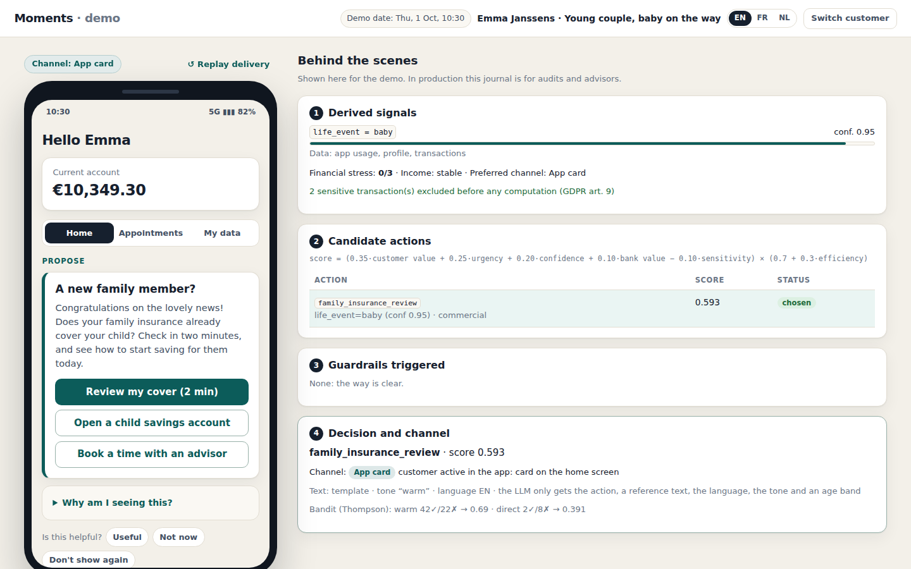
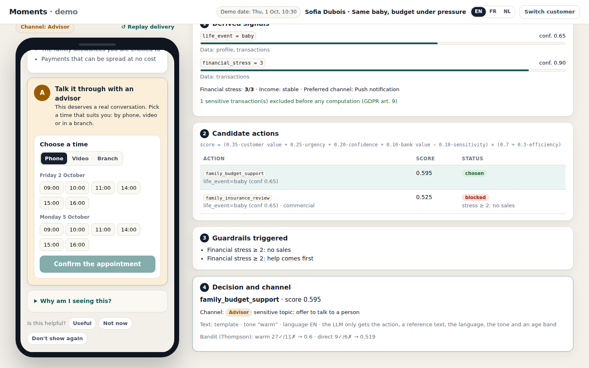
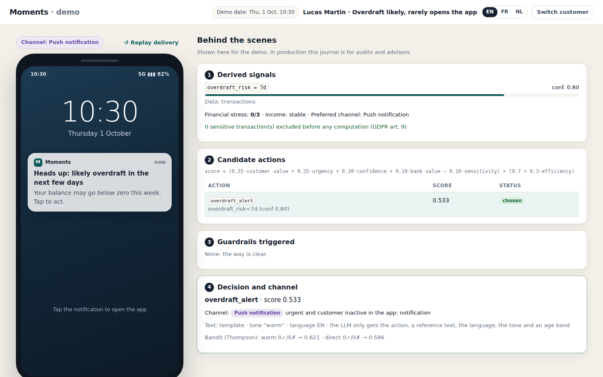
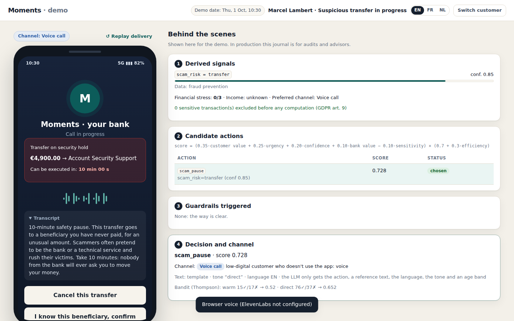

# Moments

**The right gesture, at the right moment, for each of 2.3 million customers — and the courage to do nothing when nothing is useful.**

Proof of concept for the **KBC challenge** of the Tectonic Hackathon.
Moments detects the *life moment* each customer is in, decides **one** useful action, picks the right channel (app card, push notification, voice call, advisor) and always explains **why**. When nothing is useful, it **abstains**, and says so.

> All data is **100% synthetic**. No data from KBC or from any real customer is used.

---

## In 30 seconds

| | |
| --- | --- |
| **Idea** | Replace "campaigns sent to segments" with "one decision per customer and per moment". |
| **Key difference** | The same signal can lead to opposite decisions depending on the situation. And the system knows how to abstain. |
| **Architecture** | Signals → derived signals → deterministic decision → channel → rendering (optional LLM, validated and cached) → feedback. |
| **The LLM never decides** | It only rewrites a reference text inside typed fields. The decision stays auditable. |
| **Four channels** | App card, push notification (lock screen), voice call (ElevenLabs), advisor (appointment booking). The phone screen changes with the channel. |
| **Human in the loop** | Typed advisor tasks (outreach, callback, appointment, credit review, fraud review), each with its own allowed actions and an audit trail. |
| **Three languages** | English, French, Dutch: interface and message content, switchable live. |
| **Scale** | ≈ 30,000 decisions / second on one core: 2.3 M customers in about 75 s. The LLM only runs for customers with an action, and its texts are reused per segment. |
| **Ethics by design** | No sales under financial stress, consent per data family, sensitive data (GDPR art. 9) excluded before any computation, credit always validated by a person (art. 22). |

## The demo: eight customers, four channels

| Customer | Situation | Engine decision | Channel |
| --- | --- | --- | --- |
| **Emma** | Young couple, baby-store purchases + family insurance simulation | **Propose**: review family insurance + child savings | App card |
| **Sofia** | *Same* baby purchases, but balance falling, savings at zero, late fees | **Accompany**: budget plan + advisor. **No sales.** | Advisor (booking) |
| **Jan & Monique** | Grandparents, "birth of Lena" transfer, low digital | **Inform**: grandchild savings, gifts | Voice call |
| **Marcel** | 78, €4,900 transfer to an unknown beneficiary | **Protect**: 10-minute safety pause + urgent fraud review | Voice call |
| **Lucas** | Overdraft likely this week, hasn't opened the app for 20 days | **Protect**: overdraft alert | Push notification |
| **Yasmine** | First salary, student account | **Inform**: 50/30/20 rule + automatic savings | App card |
| **Thomas** | Nothing in particular | **Abstain**, and say so | App card |
| **Nina** | Abandoned loan simulation | **Simplify**: resume the simulation. Credit = human decision | App card |

Every customer screen comes with a **behind-the-scenes** panel: signals detected, candidate actions and their scores, guardrails triggered, channel and why, source of the text.

| Emma · app card | Sofia · advisor booking, no sales |
| --- | --- |
|  |  |
| **Lucas · push notification** | **Marcel · voice call + scam pause** |
|  |  |

Advisor console (task queue with typed actions, agenda, learning, fairness, cost calculator): [screenshot](docs/screenshots/advisor.png).

## Run it (2 minutes)

Requirements: Python 3.10+.

**macOS / Linux**

```bash
python -m venv .venv && source .venv/bin/activate
pip install -r requirements-dev.txt
printf 'SECRET_KEY=%s\nDEMO_PASSWORD=Demo-Tectonic-2026\n' "$(python -c 'import secrets; print(secrets.token_urlsafe(48))')" > .env
python -m data.generate
python -m scripts.simulate_feedback
uvicorn app.main:app --reload
```

**Windows (PowerShell)**

```powershell
python -m venv .venv; .venv\Scripts\Activate.ps1
pip install -r requirements-dev.txt
@"
SECRET_KEY=$(python -c "import secrets; print(secrets.token_urlsafe(48))")
DEMO_PASSWORD=Demo-Tectonic-2026
"@ | Out-File -Encoding ascii .env
python -m data.generate
python -m scripts.simulate_feedback
uvicorn app.main:app --reload
```

- Customer demo: <http://localhost:8000> (users: `emma`, `sofia`, `jan`, `marcel`, `lucas`, `yasmine`, `thomas`, `nina`)
- Advisor console: <http://localhost:8000/advisor> (user `advisor`)
- Password: the value of `DEMO_PASSWORD`. Without it, random passwords are generated and written to `.demo_credentials` (not versioned).
- Language: **EN / FR / NL** switch in the top bar (interface and message content).
- To reset the demo: run `python -m data.generate` and `python -m scripts.simulate_feedback` again.

Options (in `.env`, see `.env.example`):

| Variable | Effect |
| --- | --- |
| `GEMINI_API_KEY` | Turns on rewriting by Gemini (constrained JSON output, validated, cached). Without a key: templates. |
| `ELEVENLABS_API_KEY` | Turns on the ElevenLabs voice (audio cached). Without a key: the browser's speech synthesis. |
| `ALLOWED_HOSTS` | Host header allow-list (default `localhost,127.0.0.1`). Add your domain when deploying. |
| `DEMO_MODE=false` | Hides the engine journal from customers (production behaviour). |

Tests and benchmark:

```bash
pytest                                           # 68 tests: engine, channels, languages, human in the loop, security
python -m scripts.benchmark_scale --n 200000     # engine throughput, extrapolation to 2.3 M customers
```

## Architecture

```mermaid
flowchart LR
    A[Raw data<br/>transactions, app, products, profile] -->|GDPR art. 9 filter<br/>+ consent| B[Aggregated snapshot]
    B --> C[Derived signals<br/>life moment, stress, intent,<br/>scam risk, deadlines]
    C --> D[Decision engine<br/>candidates → score → guardrails<br/>→ ONE action or abstention]
    D --> E[Channel<br/>app · push · voice · advisor]
    D --> F[Rendering<br/>cache → validated LLM → template<br/>EN · FR · NL]
    E --> G[Phone screen per channel<br/>+ "why am I seeing this"]
    F --> G
    G --> H[Feedback<br/>useful · not now · never]
    H -->|efficiency ≤ 30% of score<br/>bandit on tone| D
    D -->|sensitive topics, credit, fraud| I[Advisor task queue<br/>typed actions + audit trail]
    G -->|booking| I
```

Details: [docs/ARCHITECTURE.md](docs/ARCHITECTURE.md).

## What the jury can check

| Criterion | Where to see it |
| --- | --- |
| **Creativity** | Abstention as a feature; the same signal leading to opposite decisions (Emma / Sofia); a phone that changes with the channel; the scam pause. [docs/VISION.md](docs/VISION.md) |
| **Technical** | Full deterministic engine, Thompson bandit, schema-validated LLM rendering, typed human-in-the-loop workflow, 68 tests, benchmark. [docs/DECISION_ENGINE.md](docs/DECISION_ENGINE.md) |
| **Fit** | Point-by-point answer to the 5 questions of the brief: [docs/VISION.md](docs/VISION.md#answers-to-the-5-questions-of-the-brief). Scale: [docs/SCALABILITY.md](docs/SCALABILITY.md) |
| **Security** | Controls aligned with Aikido's AI Code Audit (auth, authorisation, IDOR, business logic), both Aikido findings fixed and tested. [docs/SECURITY.md](docs/SECURITY.md) |

## Repository layout

```
app/
  main.py              FastAPI, TrustedHost, security headers, CSP, static front end
  config.py            configuration from environment variables (no secret in the code)
  security.py          PBKDF2, JWT, roles, login rate limiting
  i18n.py              customer-facing strings in EN / FR / NL
  db.py                SQLite schema, parameterised queries
  engine/
    sensitive.py       GDPR art. 9 filter (before any computation)
    features.py        raw data → aggregated snapshot, consent-aware
    signals.py         derived signals with confidence and readable evidence
    catalog.py         closed catalogue of actions and buttons (EN / FR / NL copy)
    decision.py        score, guardrails, arbitration, channel choice
    feedback.py        reactions, bounded efficiency, Thompson bandit, pauses after refusal
    hitl.py            advisor tasks, appointments, typed advisor actions, audit trail
    service.py         pipeline orchestration + customer actions (buttons, scam pause, booking)
  render/              LLM contract, Gemini client, templates, cache and screen assembly
  routes/              customer API (/api/me), advisor API (/api/advisor), auth
  voice.py             ElevenLabs + audio cache
data/generate.py       8 synthetic personas + advisor availability
scripts/               feedback simulation, scale benchmark
static/                vanilla front end (no innerHTML), i18n, advisor console
tests/                 engine, channels, languages, human in the loop, security
docs/                  all the documentation
```

## Documentation

| Document | Content |
| --- | --- |
| [VISION.md](docs/VISION.md) | The ideal experience "without constraints", principles, answers to the brief |
| [ARCHITECTURE.md](docs/ARCHITECTURE.md) | Pipeline, modules, data model, request flow |
| [DECISION_ENGINE.md](docs/DECISION_ENGINE.md) | Signals, score formula, guardrails, worked examples |
| [CHANNELS.md](docs/CHANNELS.md) | How the channel is chosen and what the customer sees on each one |
| [HUMAN_IN_THE_LOOP.md](docs/HUMAN_IN_THE_LOOP.md) | Advisor tasks, appointments, allowed actions, audit trail |
| [PRIVACY.md](docs/PRIVACY.md) | Consent, GDPR art. 9 and 22, legal bases, minimisation |
| [FEEDBACK_LOOP.md](docs/FEEDBACK_LOOP.md) | Reactions, efficiency, bandit, fairness |
| [SECURITY.md](docs/SECURITY.md) | Threat model, controls, Aikido findings and fixes |
| [SCALABILITY.md](docs/SCALABILITY.md) | Benchmark, cost model, production architecture |
| [BENCHMARK.md](docs/BENCHMARK.md) | Raw benchmark results |
| [API.md](docs/API.md) | API reference |
| [DECISIONS.md](docs/DECISIONS.md) | Architecture decision log |
| [DEMO_SCRIPT.md](docs/DEMO_SCRIPT.md) | Script for the video (under 3 minutes) |
| [PITCH.md](docs/PITCH.md) | Pitch and likely jury questions |
| [SUBMISSION.md](docs/SUBMISSION.md) | Builderbase submission checklist |

## What is not done (honestly)

- **No real ML model**: signals are rules and scores on synthetic data. In production, `life_event` and `financial_stress` would become trained models, and the rules would stay as guardrails.
- **Score weights not calibrated** on real data.
- **Simulated feedback** (`scripts/simulate_feedback.py`): there is no learning in production.
- **No integration** with KBC systems (core banking, Kate, CRM, calendar).
- **Simulated actions and channels**: "open child savings" records the feedback but executes nothing; push and calls are drawn on the phone mock-up, not sent. Only the voice itself is real (ElevenLabs or browser).
- **Single advisor calendar**: slots are generated for one advisor; no real calendar sync.
- **Single instance**: SQLite, in-memory login rate limiting. In production: managed database, Redis, event queue.
- **Demo authentication** (password): in production, identity would come from the bank's strong authentication (itsme, card reader).
- Demo mode shows the engine journal to the customer, for transparency with the jury. `DEMO_MODE=false` keeps it for advisors only.
