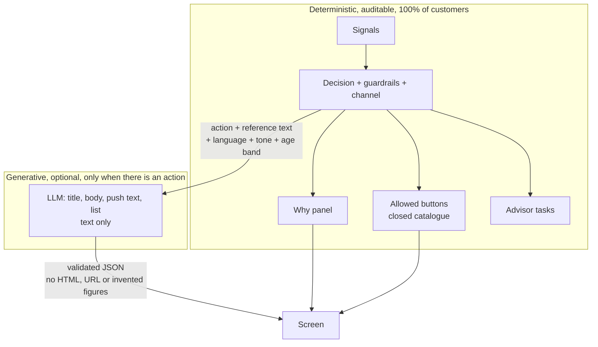
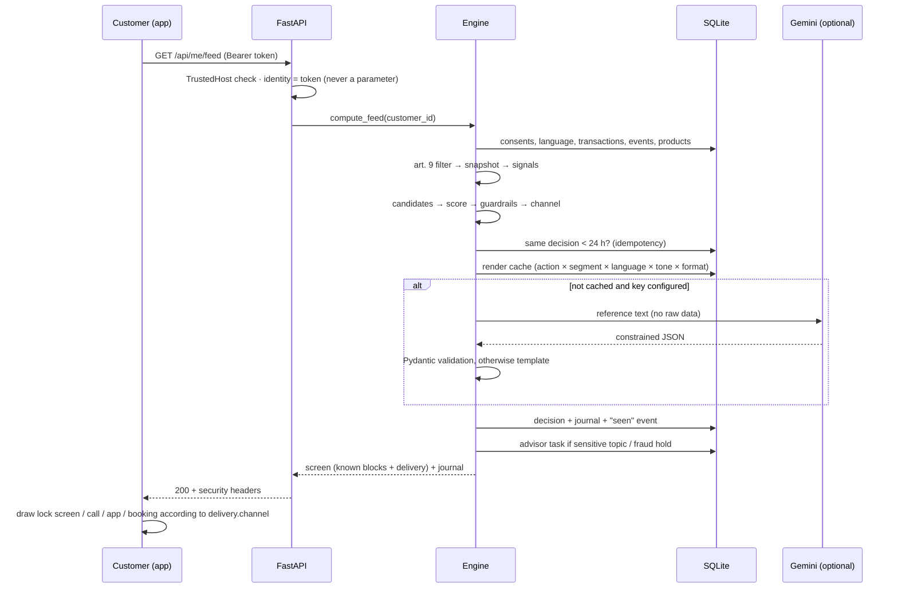

# Architecture

## The 5-stage pipeline

```
Raw data → Snapshot → Derived signals → Decision + channel → Rendering → Feedback
                                               └──────────────→ Advisor tasks (human in the loop)
```

| Stage | Module | Role | Cost per customer |
| --- | --- | --- | --- |
| 0. Filter | `engine/sensitive.py` | Removes GDPR art. 9 categories before any computation, keeps only their count | ~0 |
| 1. Snapshot | `engine/features.py` | Aggregates transactions, app events, products, profile. A family without consent is not computed | ~0 (batch) |
| 2. Derived signals | `engine/signals.py` | Life moment, stress, intent, scam risk, deadlines, channel preference. Each with confidence and evidence | ~0 |
| 3. Decision | `engine/decision.py` | Candidates → score → guardrails → one action or abstention → channel | ~0 |
| 4. Rendering | `render/` | Text: cache → validated LLM → template, in EN/FR/NL. Structure, delivery and "why": assembled by the server | low, cached |
| 5. Feedback | `engine/feedback.py` | Pseudonymised reactions, bounded efficiency, bandit on tone, pauses after refusal | ~0 |
| Human in the loop | `engine/hitl.py` | Typed advisor tasks, appointments, allowed actions per type, audit trail | – |

`engine/service.py` orchestrates the stages for one request and carries the customer-side business actions (buttons, scam pause, consent, language, booking).

## Key decision: the LLM never decides



Consequences:
- **Compliance**: the decision can be explained line by line (journal).
- **Security**: the LLM can neither inject code, nor invent a button, nor lie in the "why".
- **Cost**: no LLM call to decide, and texts are generic per segment, so they are reused.
- **Resilience**: without an API key, on error or on invalid output, the template takes over. The screen never breaks.

## Flow of `GET /api/me/feed`



## Data model

| Table | Content | Note |
| --- | --- | --- |
| `customers` | synthetic profile, preferred language (en/fr/nl) | |
| `transactions` | date, amount, category, label | art. 9 categories exist but are never read by the engine |
| `app_events` | screen, action (view / start / abandon) | |
| `products` | type, deadline | |
| `pending_transfers` | pending transfers, status, end of hold | the hold is checked on the server with the real clock |
| `users` | username, PBKDF2 hash, role, linked customer | |
| `consents` | customer × data family → on/off | |
| `decisions` | action, channel, score, variant, journal, screen | access key for IDOR checks |
| `action_events` | reaction per decision, **pseudonymised id** | no transaction data |
| `suppressions` | pauses after refusal (30 d) or permanent | |
| `advisor_tasks` | typed task, priority, reason, outcome | |
| `task_events` | audit trail of every task | |
| `appointment_slots` | advisor availability | |
| `appointments` | booking, mode, status | partial unique index: one active booking per slot |
| `render_cache` | texts per cache key, source, reuses | |
| `meta` | pseudonymisation salt (random, generated in the database) | |

## Front end

- Vanilla HTML/CSS/JS, no framework, no external dependency (CSP `default-src 'self'`).
- **No `innerHTML`**: everything is built with `createElement` and `textContent`. Even a malicious text would be shown as text.
- The front end only renders **known block types** and ignores the rest.
- Interface translations in `static/i18n.js` (EN/FR/NL); customer message content is translated on the server.
- Two pages: the customer demo (phone + behind the scenes) and the advisor console (task queue, agenda, learning, fairness, cost calculator).

## Technical choices

| Choice | Why |
| --- | --- |
| FastAPI + Pydantic | Strict input validation, quick to write, readable for the jury |
| Starlette 1.7 (pinned) | Patched against the Host header injection flagged by Aikido |
| SQLite | Zero install. In production: BigQuery for the batch, Postgres or Firestore for real time |
| Gemini via REST, `responseSchema` | Hackathon GCP credits; JSON output constrained at the source then revalidated |
| ElevenLabs, optional | Hackathon partner; multilingual voice for low-digital customers |
| Vanilla front end | No build chain, strict CSP possible, no dependency surface |
