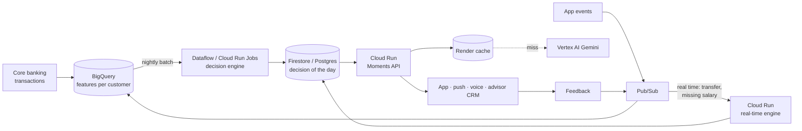

# Scale: 2.3 million customers

## The argument in one line

**Deciding costs microseconds and runs on 100% of customers. Writing costs tokens, only happens when there is an action, and the text is reused per segment.**

## 1. Decision: measured

`python -m scripts.benchmark_scale --n 200000` (full results: [BENCHMARK.md](BENCHMARK.md)):

| Measure | Value |
| --- | --- |
| Throughput for signals + decision + guardrails | ≈ 30,000 customers / s on **a single core**, in pure Python |
| 2.3 M customers | ≈ 75 s on one core, a few seconds on 16 cores |
| Customers with an action (synthetic population) | ≈ 10% at a given moment, before the frequency cap; most days the engine abstains |

The computation is embarrassingly parallel: every customer is independent. It can run as a nightly batch or as a stream.

## 2. Writing: modelled

The render cache key is `action × segment × language × tone × format` (screen or voice). The text is generic (`{first_name}` is inserted by the server), so it is reused by every customer of the segment.

Order of magnitude: ~15 actions × ~12 segments × 3 languages × 2 tones × 2 formats ≈ **2,160 texts** for the whole base, regenerated when the catalogue or the prompt changes.

The calculator in the advisor console makes this interactive. With the default (editable) assumptions:

| Assumption (default) | Value |
| --- | --- |
| Customers | 2,300,000 |
| Customers with an action per day | 3% |
| Cache reuse | 95% |
| Tokens per render | 700 in, 250 out |
| LLM price | indicative, check the provider's current price list |
| Voice | 5% of actions, 400 characters, 90% audio reuse |

| Result | Order of magnitude |
| --- | --- |
| Real LLM calls per day | ≈ 3,500 |
| Monthly LLM + voice cost | a few hundred dollars |
| Cost per customer per year | a fraction of a cent |
| Naive approach (an LLM reading every customer every day) | ≈ 250 times more expensive |

Exact amounts depend on current prices: they are entered in the calculator, not hard-coded.

## 3. Human in the loop at scale

Only sensitive topics, bookings, credit and fraud reach advisors (≈ 5% of actions in the benchmark are routed to a human). Tasks are typed and prioritised (fraud first), so a queue can be split by team: branch advisors, credit officers, fraud specialists.

## 4. Production architecture (proposal, on Google Cloud)



- **Batch** for slow moments (baby, retirement, deadlines): one pass per night.
- **Real time** for urgent moments (suspicious transfer, overdraft): triggered by events, same engine.
- The engine is the same code in both cases: `decide(snapshot, signals, context)` is a pure function.

## 5. Deploying the demo on Cloud Run (hackathon GCP credits)

```bash
gcloud run deploy moments --source . --region europe-west1 --allow-unauthenticated \
  --set-env-vars SECRET_KEY=<random-key>,DEMO_PASSWORD=<password>,ALLOWED_HOSTS=<service-host>.run.app,ALLOWED_ORIGINS=https://<service-host>.run.app
```

The container generates the synthetic data and the simulation at start-up. For the Gemini and ElevenLabs keys, prefer Secret Manager (`--set-secrets`) over plain variables. Remember `ALLOWED_HOSTS`: without the Cloud Run host name, every request is rejected with 400 (that is the Host header protection working).
