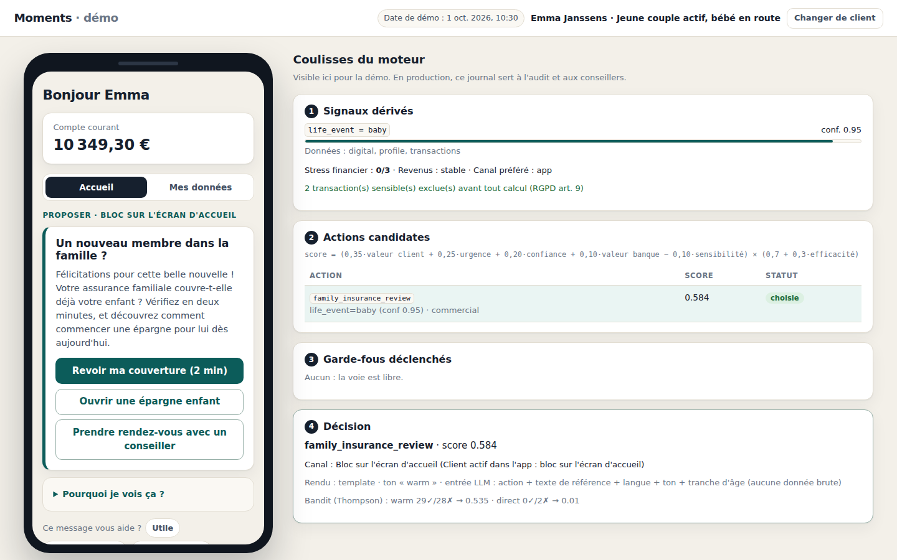
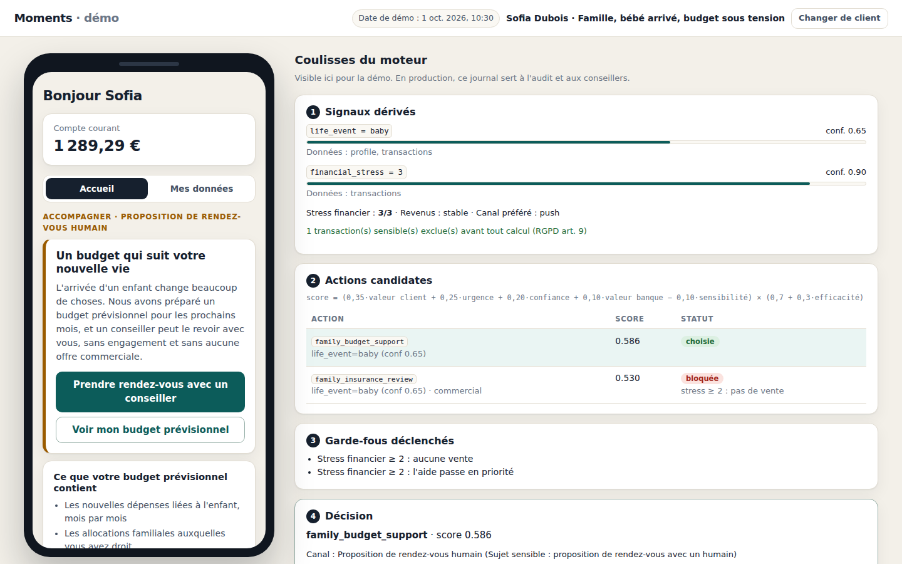
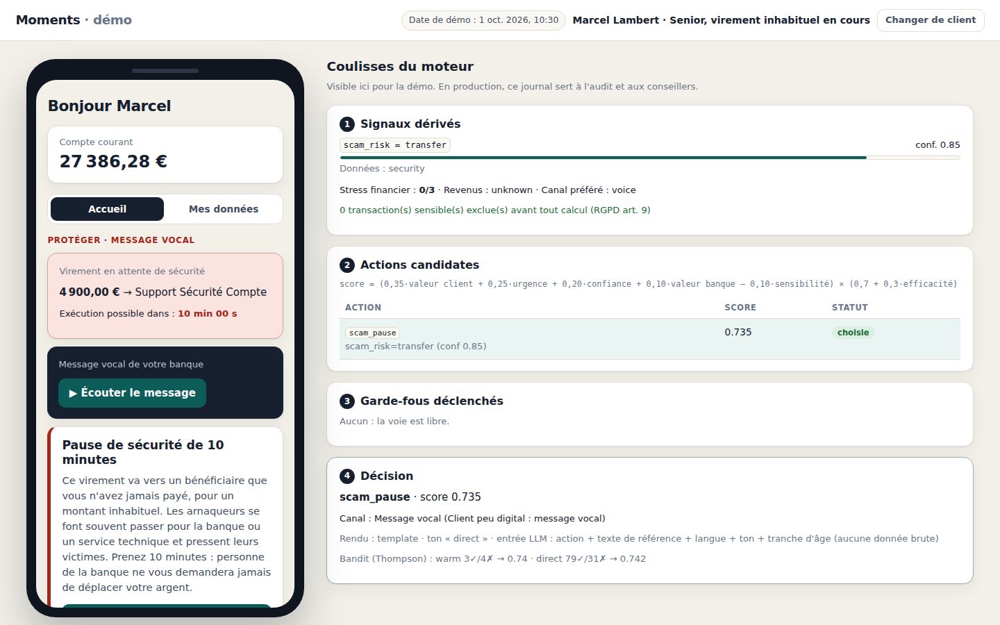
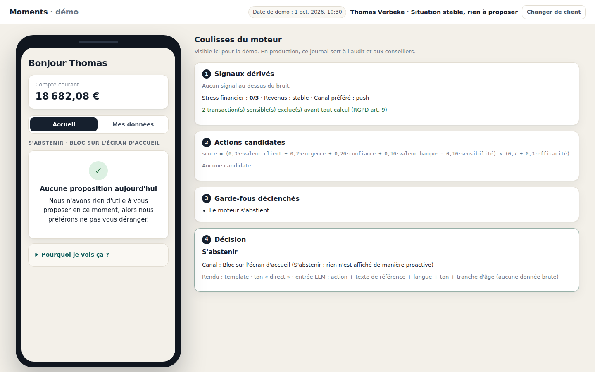
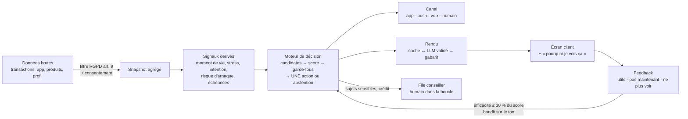

# Moments

**Le bon geste, au bon moment, pour chacun des 2,3 millions de clients, et le courage de ne rien faire quand rien n'est utile.**

Proof of concept pour le **challenge KBC** du Tectonic Hackathon.
Moments détecte le *moment de vie* dans lequel se trouve chaque client, décide **une seule** action utile, choisit le bon canal (app, notification, voix, humain) et explique toujours **pourquoi**. Et quand rien n'est utile, il **s'abstient**, et il le dit.

> Toutes les données sont **100 % synthétiques**. Aucune donnée de KBC ni d'aucun client réel n'est utilisée.

---

## En 30 secondes

| | |
| --- | --- |
| **Idée** | Remplacer « des campagnes envoyées à des segments » par « une décision par client et par moment ». |
| **Différence clé** | Le même signal peut mener à des décisions opposées selon la situation. Et le système sait s'abstenir. |
| **Architecture** | Signaux → signaux dérivés → décision déterministe → rendu (LLM optionnel, validé et mis en cache) → feedback. |
| **Le LLM ne décide jamais** | Il ne fait que reformuler un texte de référence dans des champs typés. La décision reste auditable. |
| **Échelle** | ≈ 33 000 décisions / seconde sur un cœur : 2,3 M clients en ~70 s. Le LLM ne concerne que les clients avec une action, et ses textes sont réutilisés par segment. |
| **Éthique by design** | Aucune vente en cas de stress financier, consentement par famille de données, données sensibles (RGPD art. 9) exclues avant tout calcul, crédit toujours validé par un humain (art. 22). |

## La démo : un même événement, sept histoires

| Client | Situation | Décision du moteur | Canal |
| --- | --- | --- | --- |
| **Emma** | Jeune couple, achats bébé + simulation assurance famille | **Proposer** : revoir l'assurance famille + épargne enfant | App |
| **Sofia** | *Mêmes* achats bébé, mais solde en baisse, épargne à zéro, frais de retard | **Accompagner** : budget prévisionnel + conseiller. **Aucune vente.** | Humain |
| **Jan & Monique** | Grands-parents, virement « Geboorte Lena », peu digitaux, néerlandophones | **Informer** : épargne petit-enfant, donation | Voix (NL) |
| **Marcel** | 78 ans, virement de 4 900 € vers un bénéficiaire inconnu | **Protéger** : pause de sécurité de 10 min, impossible à contourner | Voix + app |
| **Yasmine** | Premier salaire, compte étudiant | **Informer** : règle 50/30/20 + épargne automatique | App |
| **Thomas** | Rien de particulier | **S'abstenir**, et le dire | App |
| **Nina** | Simulation de prêt abandonnée, pages crédit consultées | **Simplifier** : reprendre la simulation. Crédit = décision humaine | App |

Chaque écran client est accompagné des **coulisses du moteur** : signaux détectés, actions candidates et leur score, garde-fous déclenchés, choix du canal, source du texte.

| Emma : proposer | Sofia : même signal, aucune vente |
| --- | --- |
|  |  |
| **Marcel : pause anti-arnaque** | **Thomas : s'abstenir** |
|  |  |

Espace conseiller (file d'attente, apprentissage, équité, calculateur de coût) : [capture](docs/screenshots/conseiller.png).

## Lancer le projet (2 minutes)

Prérequis : Python 3.11+.

```bash
git clone <URL_DU_REPO> moments && cd moments
python -m venv .venv && source .venv/bin/activate        # Windows : .venv\Scripts\activate
pip install -r requirements-dev.txt

# Clé de signature des sessions (obligatoire hors démo jetable)
echo "SECRET_KEY=$(python -c 'import secrets; print(secrets.token_urlsafe(48))')" > .env

DEMO_PASSWORD=Demo-Tectonic-2026 python -m data.generate   # base synthétique + comptes de démo
python -m scripts.simulate_feedback                          # 30 jours de feedback simulé (tableau de bord)
uvicorn app.main:app --reload
```

- Démo client : <http://localhost:8000> (identifiants : `emma`, `sofia`, `jan`, `marcel`, `yasmine`, `thomas`, `nina`)
- Espace conseiller : <http://localhost:8000/conseiller> (identifiant `conseiller`)
- Mot de passe : la valeur de `DEMO_PASSWORD`. Sans elle, des mots de passe aléatoires sont générés et écrits dans `.demo_credentials` (non versionné).

Options (dans `.env`, voir `.env.example`) :

| Variable | Effet |
| --- | --- |
| `GEMINI_API_KEY` | Active la reformulation par Gemini (sortie JSON contrainte, validée, mise en cache). Sans clé : gabarits. |
| `ELEVENLABS_API_KEY` | Active la voix ElevenLabs (audio mis en cache). Sans clé : synthèse vocale du navigateur. |
| `DEMO_MODE=false` | Masque le journal du moteur côté client (comportement production). |

Tests et benchmark :

```bash
pytest                                           # 46 tests : moteur, garde-fous, sécurité (auth, IDOR, logique métier)
python -m scripts.benchmark_scale --n 200000     # débit du moteur, extrapolation à 2,3 M clients
```

Docker / Cloud Run : `docker build -t moments . && docker run -p 8080:8080 -e SECRET_KEY=... -e DEMO_PASSWORD=... moments` (voir [docs/SCALABILITY.md](docs/SCALABILITY.md)).

## Architecture



Détails : [docs/ARCHITECTURE.md](docs/ARCHITECTURE.md).

## Ce que le jury peut vérifier

| Critère | Où le voir |
| --- | --- |
| **Créativité** | L'abstention comme fonctionnalité ; le même signal qui mène à des décisions opposées (Emma / Sofia) ; la pause anti-arnaque. [docs/VISION.md](docs/VISION.md) |
| **Technique** | Moteur déterministe complet, bandit de Thompson, rendu LLM validé par schéma, 46 tests, benchmark. [docs/DECISION_ENGINE.md](docs/DECISION_ENGINE.md) |
| **Fit** | Réponse point par point aux 5 questions du brief : [docs/VISION.md](docs/VISION.md#réponses-aux-5-questions-du-brief). Échelle 2,3 M : [docs/SCALABILITY.md](docs/SCALABILITY.md) |
| **Sécurité** | Contrôles alignés sur l'AI Code Audit d'Aikido (auth, autorisation, IDOR, logique métier), tous testés. [docs/SECURITY.md](docs/SECURITY.md) |

## Structure du repo

```
app/
  main.py              FastAPI, en-têtes de sécurité, CSP, front statique
  config.py            configuration par variables d'environnement (aucun secret dans le code)
  security.py          PBKDF2, JWT, rôles, limitation des tentatives de connexion
  db.py                schéma SQLite, requêtes paramétrées
  engine/
    sensitive.py       filtre RGPD art. 9 (avant tout calcul)
    features.py        données brutes → snapshot agrégé, respect du consentement
    signals.py         signaux dérivés avec confiance et preuves lisibles
    catalog.py         catalogue fermé d'actions et de boutons
    decision.py        score, garde-fous, arbitrage, choix du canal
    feedback.py        réactions, efficacité bornée, bandit de Thompson, pauses après refus
    service.py         orchestration du pipeline + actions métier (CTA, pause anti-arnaque)
  render/              contrat LLM, client Gemini, gabarits, cache et assemblage de l'écran
  routes/              API client (/api/me), conseiller (/api/advisor), auth
  voice.py             ElevenLabs + cache audio
data/generate.py       7 personas synthétiques
scripts/               simulation du feedback, benchmark d'échelle
static/                front sans framework (aucun innerHTML), espace conseiller
tests/                 moteur + sécurité
docs/                  toute la documentation
```

## Documentation

| Document | Contenu |
| --- | --- |
| [VISION.md](docs/VISION.md) | L'expérience idéale « sans contraintes », les principes, les réponses au brief |
| [ARCHITECTURE.md](docs/ARCHITECTURE.md) | Pipeline, modules, modèle de données, flux d'une requête |
| [DECISION_ENGINE.md](docs/DECISION_ENGINE.md) | Signaux, formule de score, garde-fous, canaux, exemples chiffrés |
| [PRIVACY.md](docs/PRIVACY.md) | Consentement, RGPD art. 9 et 22, bases légales, minimisation |
| [FEEDBACK_LOOP.md](docs/FEEDBACK_LOOP.md) | Réactions, efficacité, bandit, équité |
| [SECURITY.md](docs/SECURITY.md) | Modèle de menace, contrôles, procédure Aikido |
| [SCALABILITY.md](docs/SCALABILITY.md) | Benchmark, modèle de coût, architecture de production |
| [BENCHMARK.md](docs/BENCHMARK.md) | Résultats bruts du benchmark |
| [API.md](docs/API.md) | Référence de l'API |
| [DECISIONS.md](docs/DECISIONS.md) | Journal des décisions d'architecture |
| [DEMO_SCRIPT.md](docs/DEMO_SCRIPT.md) | Script de la vidéo de moins de 3 minutes |
| [PITCH.md](docs/PITCH.md) | Pitch et questions probables du jury |
| [SUBMISSION.md](docs/SUBMISSION.md) | Check-list de soumission Builderbase |

## Ce qui n'est pas fait (honnêtement)

- **Pas de vrai modèle ML** : les signaux sont des règles et des scores sur des données synthétiques. En production, `life_event` et `financial_stress` deviendraient des modèles entraînés, et les règles resteraient des garde-fous.
- **Poids du score non calibrés** sur des données réelles.
- **Feedback simulé** (`scripts/simulate_feedback.py`) : il n'y a pas d'apprentissage en production.
- **Pas d'intégration** avec les systèmes de KBC (ni core banking, ni Kate, ni CRM).
- **Actions simulées** : « ouvrir une épargne enfant » ou « décaler un paiement » enregistrent le feedback mais n'exécutent rien.
- **Mono-instance** : SQLite, limitation des connexions en mémoire. En production : base managée, Redis, file d'événements.
- **Authentification de démo** (mot de passe) : en production, l'identité viendrait de l'authentification forte existante de la banque (itsme, lecteur de carte).
- Le mode démo expose le journal du moteur au client, pour la transparence devant le jury. `DEMO_MODE=false` le réserve aux conseillers.
