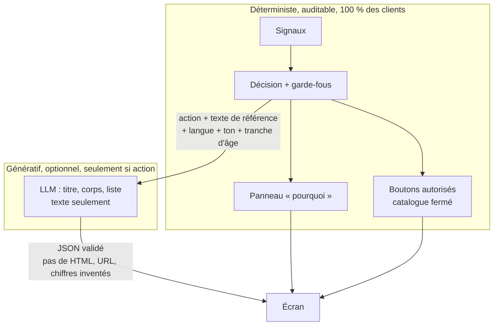
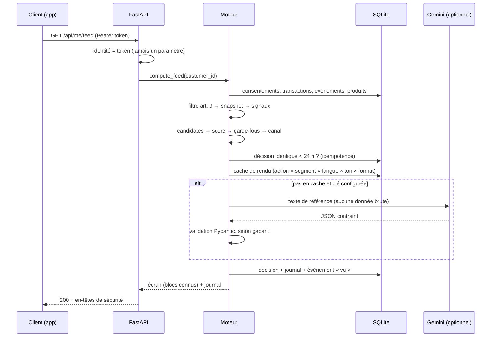

# Architecture

## Le pipeline en 5 étages

```
Données brutes → Snapshot (signaux bruts) → Signaux dérivés → Décision → Rendu → Feedback
```

| Étage | Module | Rôle | Coût par client |
| --- | --- | --- | --- |
| 0. Filtre | `engine/sensitive.py` | Retire les catégories RGPD art. 9 avant tout calcul, en ne gardant que leur nombre | ~0 |
| 1. Snapshot | `engine/features.py` | Agrège transactions, événements app, produits, profil. Une famille sans consentement n'est pas calculée | ~0 (batch) |
| 2. Signaux dérivés | `engine/signals.py` | Moment de vie, stress, intention, risque d'arnaque, échéances, canal préféré. Chaque signal a une confiance et des preuves | ~0 |
| 3. Décision | `engine/decision.py` | Candidates → score → garde-fous → une action ou l'abstention → canal | ~0 |
| 4. Rendu | `render/` | Texte : cache → LLM validé → gabarit. Structure et « pourquoi » : assemblés par le serveur | faible, mis en cache |
| 5. Feedback | `engine/feedback.py` | Réactions pseudonymisées, efficacité bornée, bandit sur le ton, pauses après refus | ~0 |

`engine/service.py` orchestre ces étages pour une requête et porte les actions métier (boutons, pause anti-arnaque, file conseiller).

## Décision clé : le LLM ne décide jamais



Conséquences :
- **Conformité** : la décision est explicable ligne par ligne (journal).
- **Sécurité** : le LLM ne peut ni injecter de code, ni inventer un bouton, ni mentir dans le « pourquoi ».
- **Coût** : aucun appel LLM pour décider, et les textes sont génériques par segment, donc réutilisables.
- **Résilience** : sans clé API, en cas d'erreur ou de sortie invalide, le gabarit prend le relais. L'écran ne casse jamais.

## Flux d'une requête `GET /api/me/feed`



## Modèle de données

| Table | Contenu | Remarque |
| --- | --- | --- |
| `customers` | profil synthétique | |
| `transactions` | date, montant, catégorie, libellé | les catégories art. 9 existent mais ne sont jamais lues par le moteur |
| `app_events` | écran, action (view / start / abandon) | |
| `products` | type, échéance | |
| `pending_transfers` | virements en attente, statut, fin de pause | la pause est vérifiée côté serveur, avec l'horloge réelle |
| `users` | identifiant, hash PBKDF2, rôle, client lié | |
| `consents` | client × famille de données → activé | |
| `decisions` | action, canal, score, variante, journal, écran | clé d'accès pour l'IDOR |
| `action_events` | réaction par décision, **identifiant pseudonymisé** | aucune donnée transactionnelle |
| `suppressions` | pauses après refus (30 j) ou définitives | |
| `advisor_tasks` | file d'attente humaine | |
| `render_cache` | textes par clé de cache, source, réutilisations | |
| `meta` | sel de pseudonymisation (aléatoire, généré en base) | |

## Front

- HTML/CSS/JS sans framework ni dépendance externe (CSP `default-src 'self'`).
- **Aucun `innerHTML`** : tout est construit avec `createElement` et `textContent`. Même un texte malveillant serait affiché comme du texte.
- Le front n'affiche que des **types de blocs connus** (`highlight`, `checklist`, `why_panel`, `transfer_hold`, `voice`, `human`, `abstain`) et ignore le reste.
- Deux pages : la démo client (téléphone + coulisses du moteur) et l'espace conseiller (file d'attente, apprentissage, équité, calculateur de coût).

## Choix techniques

| Choix | Pourquoi |
| --- | --- |
| FastAPI + Pydantic | Validation stricte des entrées, rapide à écrire, lisible par le jury |
| SQLite | Zéro installation. En production : BigQuery pour le batch, Postgres ou Firestore pour le temps réel |
| Gemini via REST, `responseSchema` | Crédits GCP du hackathon ; sortie JSON contrainte à la source puis revalidée |
| ElevenLabs, optionnel | Partenaire du hackathon ; voix multilingue (FR/NL) pour les clients peu digitaux |
| Front vanilla | Aucune chaîne de build, CSP stricte possible, pas de surface de dépendances |
