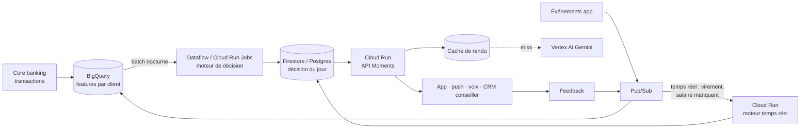

# Passage à l'échelle : 2,3 millions de clients

## L'argument en une ligne

**Décider coûte des microsecondes et se fait sur 100 % des clients. Rédiger coûte des tokens, se fait seulement quand il y a une action, et le texte est réutilisé par segment.**

## 1. Décision : mesurée

`python -m scripts.benchmark_scale --n 200000` (résultats complets : [BENCHMARK.md](BENCHMARK.md)) :

| Mesure | Valeur |
| --- | --- |
| Débit signaux + décision + garde-fous | ≈ 33 000 clients / s sur **un seul cœur**, en Python pur |
| 2,3 M clients | ≈ 70 s sur un cœur, quelques secondes sur 16 cœurs |
| Clients avec une action (population synthétique) | ≈ 10 % à un instant donné, avant plafond de fréquence ; la plupart des jours, le moteur s'abstient |

Le calcul est **embarrassingly parallel** : chaque client est indépendant. Il peut tourner en batch nocturne ou en streaming.

## 2. Rédaction : modélisée

La clé de cache du rendu est `action × segment × langue × ton × format` (écran ou voix). Le texte est générique (`{first_name}` est inséré par le serveur), donc réutilisable par tous les clients du segment.

Ordre de grandeur : ~15 actions × ~12 segments × 2 langues × 2 tons × 2 formats ≈ **1 440 textes** pour toute la base, à régénérer quand on change le catalogue ou le prompt.

Le calculateur de l'espace conseiller rend ce raisonnement interactif. Avec les hypothèses par défaut (modifiables) :

| Hypothèse (par défaut) | Valeur |
| --- | --- |
| Clients | 2 300 000 |
| Clients avec une action par jour | 3 % |
| Réutilisation du cache | 95 % |
| Tokens par rendu | 700 en entrée, 250 en sortie |
| Tarif LLM | indicatif, à vérifier sur la grille actuelle du fournisseur |
| Voix | 5 % des actions, 400 caractères, 90 % de réutilisation audio |

| Résultat | Ordre de grandeur |
| --- | --- |
| Appels LLM réels par jour | ≈ 3 500 |
| Coût mensuel LLM + voix | quelques centaines de dollars |
| Coût par client et par an | une fraction de centime |
| Approche naïve (un LLM qui lit le profil de chaque client chaque jour) | ≈ 250 fois plus cher |

Les montants exacts dépendent des tarifs du moment : ils sont saisis dans le calculateur, pas figés dans le code.

## 3. Architecture de production (proposition, sur Google Cloud)



- **Batch** pour les moments lents (bébé, retraite, échéances) : une passe par nuit.
- **Temps réel** pour les moments urgents (virement suspect, découvert) : déclenché par événement, même moteur.
- Le moteur est le même code dans les deux cas : `decide(snapshot, signals, context)` est une fonction pure.

## 4. Déployer la démo sur Cloud Run (crédits GCP du hackathon)

```bash
gcloud run deploy moments --source . --region europe-west1 --allow-unauthenticated \
  --set-env-vars SECRET_KEY=<clé-aléatoire>,DEMO_PASSWORD=<mot-de-passe>,ALLOWED_ORIGINS=https://<url-cloud-run>
```

Le conteneur génère la base synthétique et la simulation au démarrage. Pour les clés Gemini et ElevenLabs, préférer Secret Manager (`--set-secrets`) aux variables en clair.
